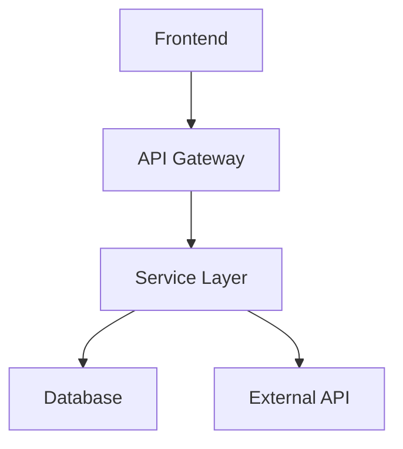

# Abordagem Técnica: {{TASK_NAME}}

<!-- SOLUTION_OVERVIEW -->
## 🎯 Visão Geral da Solução

<executive_summary>
*Breve descrição da solução técnica proposta, incluindo principais componentes e tecnologias utilizadas.*
</executive_summary>

<technical_objectives>
### Objetivos Técnicos
- **Objetivo 1**: Descrição específica do objetivo técnico
- **Objetivo 2**: Descrição específica do objetivo técnico
- **Objetivo 3**: Descrição específica do objetivo técnico
</technical_objectives>

<complexity_assessment>
### Avaliação de Complexidade
- **Nível**: Baixa/Média/Alta
- **Tempo Estimado**: X dias/horas
- **Risco**: Baixo/Médio/Alto
- **Dependências**: Lista de dependências críticas
</complexity_assessment>
<!-- END_SOLUTION_OVERVIEW -->

<!-- ARCHITECTURE -->
## 🏗️ Arquitetura da Solução

<affected_components>
### Componentes Afetados
| Componente | Tipo | Responsabilidade | Impacto |
|------------|------|------------------|---------|
| Componente A | Frontend | Interface do usuário | Alto |
| Componente B | Backend | Lógica de negócio | Alto |
| Componente C | Database | Persistência | Médio |
</affected_components>

<architecture_diagram>
### Diagrama de Arquitetura

</architecture_diagram>

<data_flow>
### Fluxo de Dados
1. **Entrada**: Dados recebidos do usuário
2. **Processamento**: Validação e transformação
3. **Persistência**: Armazenamento no banco
4. **Resposta**: Retorno para o usuário
</data_flow>
<!-- END_ARCHITECTURE -->

<!-- DATA_MODELS -->
## 📊 Modelos de Dados

<main_entities>
### Entidades Principais
```typescript
interface {{EntityName}} {
  id: string;
  field1: string;
  field2: number;
  createdAt: Date;
  updatedAt: Date;
}
```
</main_entities>

<relationships>
### Relacionamentos
- **Entity A** → **Entity B** (1:N)
- **Entity B** → **Entity C** (N:1)
</relationships>

<validations>
### Validações
- **Campo 1**: Regex pattern, tamanho mínimo/máximo
- **Campo 2**: Range de valores, tipo específico
- **Campo 3**: Validação customizada de negócio
</validations>
<!-- END_DATA_MODELS -->

<!-- API_CONTRACTS -->
## 🔌 Contratos de API

<endpoints>
### Endpoints Necessários
| Método | Endpoint | Descrição | Parâmetros |
|--------|----------|-----------|------------|
| GET | `/api/{{resource}}` | Listar recursos | query params |
| POST | `/api/{{resource}}` | Criar recurso | body payload |
| PUT | `/api/{{resource}}/:id` | Atualizar recurso | id + body |
| DELETE | `/api/{{resource}}/:id` | Remover recurso | id |
</endpoints>

<schemas>
### Schemas de Request/Response
```json
{
  "request": {
    "field1": "string",
    "field2": "number"
  },
  "response": {
    "id": "string",
    "field1": "string",
    "field2": "number",
    "createdAt": "datetime"
  }
}
```
</schemas>
<!-- END_API_CONTRACTS -->

<!-- IMPLEMENTATION_PLAN -->
## 🛠️ Plano de Implementação

<phase_preparation>
### Fase 1: Preparação (Dia 1)
- [ ] **1.1** Configurar ambiente de desenvolvimento
- [ ] **1.2** Criar estrutura de pastas
- [ ] **1.3** Configurar dependências necessárias
- [ ] **1.4** Implementar testes básicos de setup
</phase_preparation>

<phase_backend>
### Fase 2: Backend (Dias 2-3)
- [ ] **2.1** Criar modelos de dados
- [ ] **2.2** Implementar validações
- [ ] **2.3** Desenvolver endpoints da API
- [ ] **2.4** Implementar testes unitários
- [ ] **2.5** Criar testes de integração
</phase_backend>

<phase_frontend>
### Fase 3: Frontend (Dias 4-5)
- [ ] **3.1** Criar componentes base
- [ ] **3.2** Implementar formulários
- [ ] **3.3** Integrar com API
- [ ] **3.4** Implementar tratamento de erros
- [ ] **3.5** Criar testes de componente
</phase_frontend>

<phase_integration>
### Fase 4: Integração & Testes (Dia 6)
- [ ] **4.1** Testes end-to-end
- [ ] **4.2** Validação de performance
- [ ] **4.3** Testes de acessibilidade
- [ ] **4.4** Code review e ajustes
</phase_integration>
<!-- END_IMPLEMENTATION_PLAN -->

<!-- TESTING_STRATEGY -->
## 🧪 Estratégia de Testes

<unit_tests>
### Testes Unitários
- **Cobertura**: Mínimo 80%
- **Frameworks**: Jest, React Testing Library
- **Foco**: Lógica de negócio e componentes isolados
</unit_tests>

<integration_tests>
### Testes de Integração
- **API Tests**: Validação de endpoints
- **Database Tests**: Operações de CRUD
- **Component Tests**: Interação entre componentes
</integration_tests>

<e2e_tests>
### Testes E2E
- **Cenários**: Fluxos críticos de usuário
- **Ferramenta**: Cypress ou Playwright
- **Ambiente**: Staging environment
</e2e_tests>
<!-- END_TESTING_STRATEGY -->

<!-- SECURITY_CONSIDERATIONS -->
## 🔒 Considerações de Segurança

<authentication>
### Autenticação & Autorização
- **JWT Tokens**: Para autenticação de sessão
- **Role-based Access**: Controle de permissões
- **Input Sanitization**: Prevenção de XSS/SQL injection
</authentication>

<data_validation>
### Validação de Dados
- **Client-side**: Validação imediata para UX
- **Server-side**: Validação obrigatória para segurança
- **Type Safety**: TypeScript para prevenção de erros
</data_validation>
<!-- END_SECURITY_CONSIDERATIONS -->

<!-- MONITORING -->
## 📈 Monitoramento & Observabilidade

<technical_metrics>
### Métricas Técnicas
- **Performance**: Tempo de resposta, throughput
- **Errors**: Taxa de erro, tipos de erro
- **Usage**: Endpoints mais utilizados
</technical_metrics>

<structured_logs>
### Logs Estruturados
- **Request/Response**: Logs de API calls
- **Business Events**: Eventos importantes do negócio
- **Error Tracking**: Stack traces e contexto
</structured_logs>
<!-- END_MONITORING -->

<!-- DEPLOY_INFRASTRUCTURE -->
## 🚀 Deploy & Infraestrutura

<deploy_strategy>
### Estratégia de Deploy
- **Feature Flags**: Deploy gradual
- **Rollback Plan**: Plano de reversão
- **Health Checks**: Verificação de saúde
</deploy_strategy>

<environments>
### Ambientes
- **Development**: Ambiente local
- **Staging**: Ambiente de testes
- **Production**: Ambiente de produção
</environments>
<!-- END_DEPLOY_INFRASTRUCTURE -->

<!-- RISKS_MITIGATIONS -->
## ⚠️ Riscos & Mitigações

<technical_risks>
### Riscos Técnicos
| Risco | Probabilidade | Impacto | Mitigação |
|-------|---------------|---------|-----------|
| Performance | Média | Alto | Load testing, otimização |
| Integração | Alta | Médio | Testes de integração |
| Segurança | Baixa | Alto | Code review, pentesting |
</technical_risks>

<contingency_plan>
### Plano de Contingência
- **Rollback**: Procedimento de reversão
- **Hotfix**: Processo de correção rápida
- **Escalation**: Quando escalar para stakeholders
</contingency_plan>
<!-- END_RISKS_MITIGATIONS -->

<!-- METADATA -->
---
**Arquiteto**: {{ARCHITECT}}  
**Tech Lead**: {{TECH_LEAD}}  
**Estimativa Total**: {{ESTIMATE}}  
**Data de Início**: {{START_DATE}}  
**Data de Conclusão**: {{END_DATE}}  
**Última Atualização**: {{LAST_UPDATE}}  
**Responsável**: {{RESPONSIBLE}}
<!-- END_METADATA -->